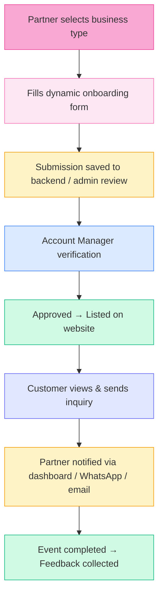
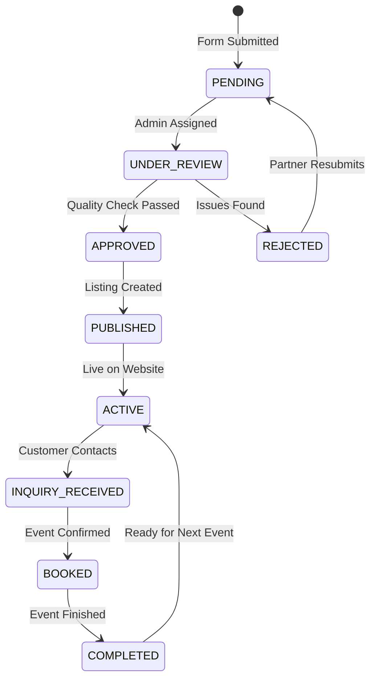

# Partner Onboarding Complete Flow

## Complete Partner Journey from Registration to Event Completion

## Detailed Process Flow

### 1. Partner Registration
- Partner visits `/partner-onboarding`
- Selects business type from 5 options:
  - Venue / Banquet / Marquee
  - Boutique / Dress Designer
  - Beauty Parlour / Salon
  - Décor / Event Styling
  - Catering / Food & Beverage
- Completes multi-step dynamic form
- Form fields adapt based on selected business type

### 2. Form Submission
- Data validated client-side using Zod schemas
- Submitted to `/api/partner-onboarding`
- Stored in `PartnerOnboardingSubmission` table
- Status set to `PENDING`
- Progress auto-saved to localStorage

### 3. Admin Review
- Admin accesses `/admin/partner-submissions`
- Views all pending submissions
- Can filter by:
  - Business Type (Venue, Boutique, Salon, Décor, Catering)
  - Status (Pending, Under Review, Approved, Rejected)
  - Date Range
  - City

### 4. Account Manager Verification
- Account Manager reviews submission
- Checks:
  - Business legitimacy
  - Contact information validity
  - Required documents
  - Quality standards
  - Pricing competitiveness

### 5. Approval & Listing
- **If Approved:**
  - Status changed to `APPROVED`
  - Partner receives confirmation email
  - Business listing created in database
  - Visible on website `/partners` page
  - Partner can manage listings through vendor dashboard

- **If Rejected:**
  - Status changed to `REJECTED`
  - Admin notes added
  - Partner notified with feedback
  - Can resubmit after corrections

### 6. Customer Discovery
- Customers browse `/partners` page
- Filter by business type, city, or search
- View partner cards with:
  - Name, image, description
  - Location (city, area)
  - Pricing information
  - Contact options (Call, WhatsApp, Email)
  - Rating (if available)

### 7. Customer Inquiry
- Customer clicks contact button
- Options available:
  - Direct WhatsApp message
  - Phone call
  - Email inquiry
- Inquiry logged in system
- Partner receives notification

### 8. Partner Notification
- Partner notified via:
  - **Dashboard**: New inquiry alert
  - **WhatsApp**: Automated message with customer details
  - **Email**: Inquiry notification email
- Partner can respond directly

### 9. Event Completion & Feedback
- Event successfully completed
- Customer feedback collected
- Rating and review added to partner profile
- Partner reputation updated
- Future customers can see ratings

## Status Flow Diagram

## Key Features

### Multi-Step Dynamic Form
- **Step 1**: Business Type Selection
- **Steps 2-4**: Shared Steps (Owner, Manager, Business Info)
- **Step 5**: Bank Details (Optional)
- **Steps 6-8**: Business-Specific Steps
- **Step 9**: General Questions
- **Step 10**: Upload & Summary
- **Step 11**: Review & Submit

### Auto-Save Functionality
- Progress saved to localStorage
- Users can resume from where they left off
- Data persists across browser sessions

### Progress Tracking
- Visual progress bar at top
- Step indicators showing completion
- Smooth animations between steps

### Responsive Design
- Mobile-friendly layout
- Touch-optimized buttons
- Adaptive grid layouts

### Contact Integration
- Floating WhatsApp widget on all pages
- Direct contact buttons on partner cards
- Multiple contact methods (Call, WhatsApp, Email)

## Demo Partner Showcase

The `/partners` page includes a showcase of demo partners:
- **6 Venues**: Various locations and capacities
- **6 Boutiques**: Different styles and price ranges
- **3 Beauty Parlours**: Professional services
- **3 Décor Partners**: Full-service event decoration
- **6 Catering Services**: Various cuisines and styles

Each demo partner includes:
- Name and business type
- Location (city and area)
- Description
- Contact information
- Pricing range
- Rating (mock)

## Technical Implementation

### Frontend
- **Framework**: Next.js 14 (App Router)
- **UI**: React, Tailwind CSS
- **Form Handling**: React Hook Form
- **Validation**: Zod
- **Animations**: Framer Motion
- **State Management**: Context API
- **Storage**: localStorage

### Backend
- **API Routes**: Next.js API Routes
- **Database**: PostgreSQL + Prisma ORM
- **File Storage**: Cloudinary (for images/documents)

### Key Components
- `PartnerShowcase`: Main showcase page
- `PartnerCard`: Individual partner card component
- `WhatsAppFloating`: Floating contact widget
- `PartnerFormProvider`: Global form state
- `useFormSteps`: Step navigation hook

## Next Steps

1. **Database Migration**: Run `npm run db:push` to update schema
2. **Test Form**: Complete onboarding for each business type
3. **View Showcase**: Visit `/partners` to see demo partners
4. **Admin Panel**: Review submissions at `/admin/partner-submissions`

