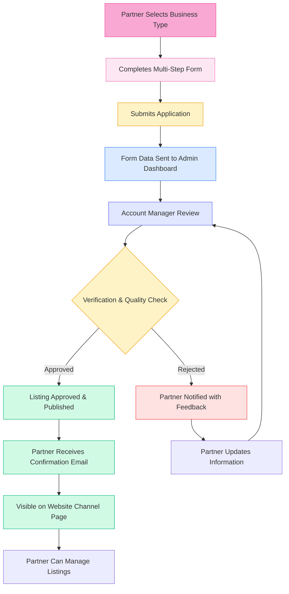
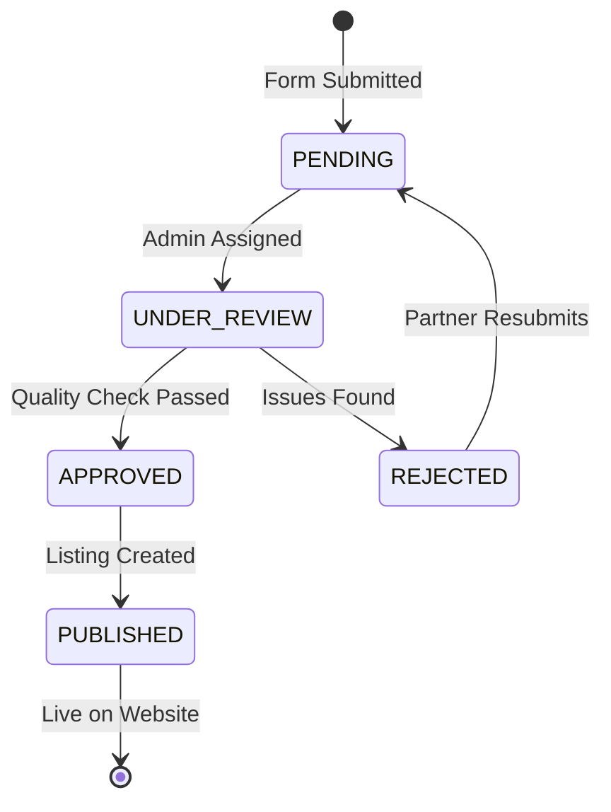

# Partner Onboarding Flow - Visual Diagram

## Complete Partner Journey from Registration to Listing

## Detailed Process Steps

### 1. Partner Registration
- Partner visits `/partner-onboarding`
- Selects business type (Venue, Boutique, or Salon)
- Completes multi-step form with:
  - Owner & Manager Details
  - Business Information
  - Bank Details
  - Business-specific fields
  - General Questions
  - File Uploads

### 2. Form Submission
- Data validated client-side
- Submitted to `/api/partner-onboarding`
- Stored in `PartnerOnboardingSubmission` table
- Status set to `PENDING`

### 3. Admin Review
- Admin accesses `/admin/partner-submissions`
- Views all pending submissions
- Can filter by:
  - Business Type
  - Status
  - Date Range
  - City

### 4. Verification Process
- Account Manager reviews submission
- Checks:
  - Business legitimacy
  - Contact information
  - Required documents
  - Quality standards

### 5. Approval/Rejection
- **If Approved:**
  - Status changed to `APPROVED`
  - Partner receives confirmation email
  - Business listing created
  - Visible on website channel page
  
- **If Rejected:**
  - Status changed to `REJECTED`
  - Admin notes added
  - Partner notified with feedback
  - Can resubmit after corrections

### 6. Listing Publication
- Approved partners appear on:
  - Venue listings page
  - Boutique listings page
  - Salon listings page
- Partners can manage their listings through vendor dashboard

## Status Flow

## Key Features

1. **Multi-Step Form**: Dynamic form that adapts based on business type
2. **Auto-Save**: Progress saved to localStorage
3. **Validation**: Real-time validation with helpful error messages
4. **Admin Dashboard**: Complete review and management system
5. **Status Tracking**: Clear status indicators throughout the process
6. **Email Notifications**: Automated emails at key stages
7. **Partner Dashboard**: Partners can track their application status

## Technical Implementation

- **Frontend**: React, Next.js, Tailwind CSS, Framer Motion
- **Form Handling**: React Hook Form with Zod validation
- **State Management**: Context API
- **Backend**: Next.js API Routes
- **Database**: PostgreSQL with Prisma ORM
- **File Storage**: Cloudinary (for images/documents)

